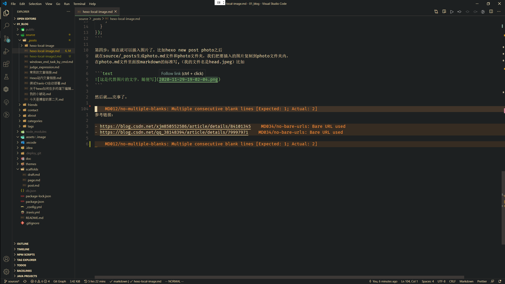
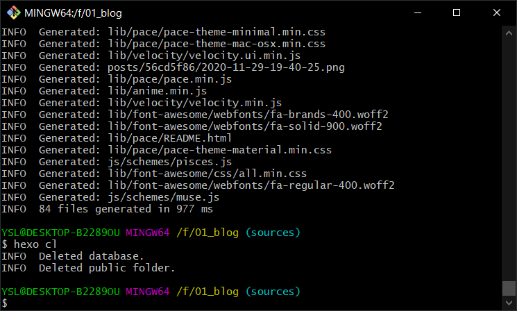

> 原链接：https://www.jianshu.com/p/f72aaad7b852
> 我自己的补充：原链接内容有错误，我又在此基础上改正了一下
> 我自己引用的链接：https://blog.csdn.net/Strong997/article/details/97767929

菜鸟一枚，插入图片的时候走了不少弯路，写篇blog记录一下。

第一步：安装插件，在hexo根目录打开Git Bash,执行

<!--more-->

```text
// npm install hexo-asset-image --save

我自己的改正：上面的不对，用下面这个：
npm install https://github.com/CodeFalling/hexo-asset-image --save
```

第二步：打开hexo的配置文件`_config.yml`

找到 `post_asset_folder`，把这个选项从`false`改成`true`

我自己的补充：把`relative_link`字段也改成`true`

第三步：更换`index.js`的代码

我自己的补充：不需要更换代码

第四步：现在就可以插入图片了，比如`hexo new post photo`之后
就在`source/_posts`生成`photo.md`文件和`photo`文件夹，我们把要插入的图片复制到`photo`文件夹内，
在`photo.md`文件里面按`markdown`的标准写,（我的文件名是`head.jpeg`）比如

```text

```

我自己的补充：注意不要有中文，并且如果改了文章文件名，同名的附件文件夹也要改成相同的名字

然后就……完事了。





参考链接：

- https://blog.csdn.net/xjm850552586/article/details/84101345
- https://blog.csdn.net/qq_38148394/article/details/79997971
